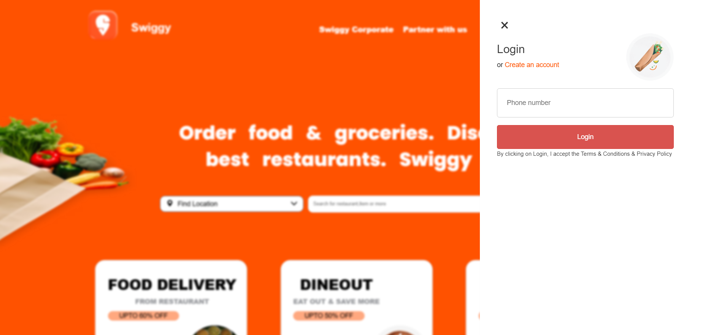
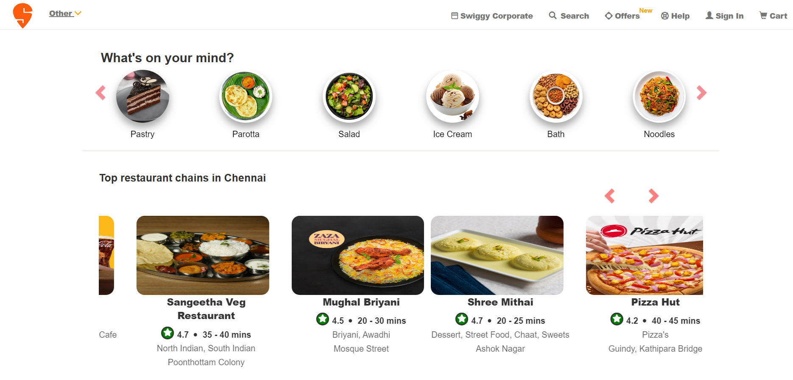
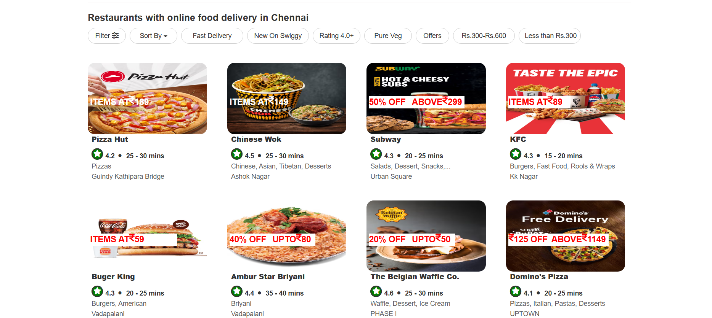
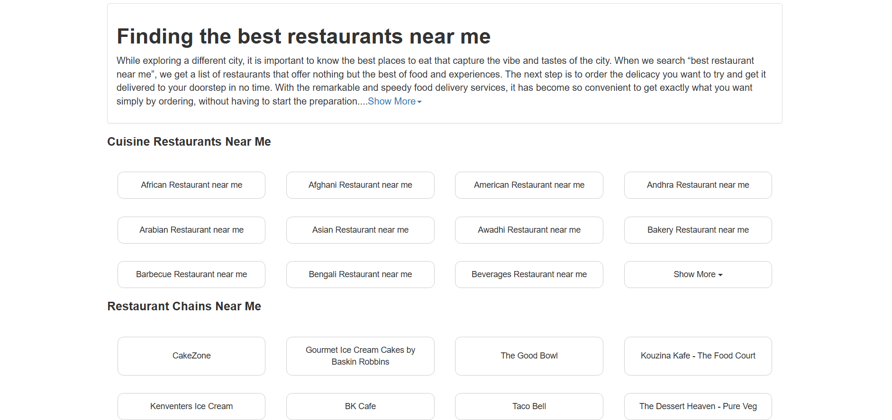
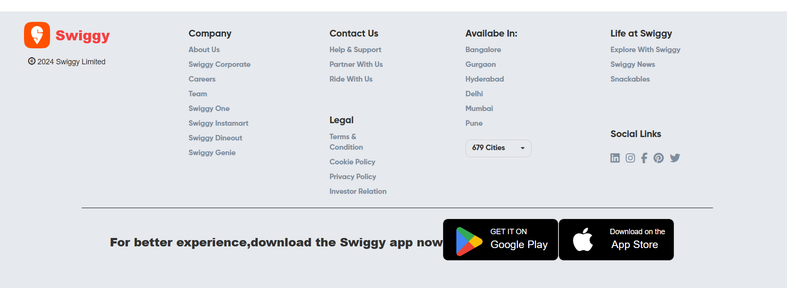

# Swiggy Clone Project

Welcome to the **Swiggy Clone** project repository! 🎉  
This project is a learning initiative aimed at building a responsive and functional clone of Swiggy's food delivery platform using foundational web development technologies.

---

## 🏗️ **Current Progress**

- **Landing Screen:**  
  Fully designed and responsive.  
  Technologies used: **HTML, CSS, Bootstrap, JavaScript**.

- **Home Screen:**  
  Completed with responsiveness.  

🎯 The README will be updated as additional pages and features are developed!


📸  **Screenshots**

### Landing Screen


### Home Screen - Part 1


### Home Screen - Part 2


### Home Screen - Part 3


### Home Screen - Part 4



---

## 🛠️ **Technologies Used**

- **HTML** for structuring the web pages  
- **CSS** for styling and layout  
- **Bootstrap** for responsive design and components  
- **JavaScript** for interactive elements  

---

## 📋 **Future Features**

1. Restaurant Listing Page  
2. Menu Display and Item Selection  
3. Cart Functionality  
4. Order Placement Workflow  

---

## 🚀 **How to Run the Project**

1. Clone the repository:
   ```bash
   git clone https://github.com/priya-6655/swiggy-clone.git
   ```
2. Open the `index.html` file in your browser.

---

## 📢 **Feedback & Contributions**

This project is part of my learning journey, and I welcome constructive feedback!  
Feel free to share your suggestions via issues or pull requests.

--- 

Happy coding! 😊
